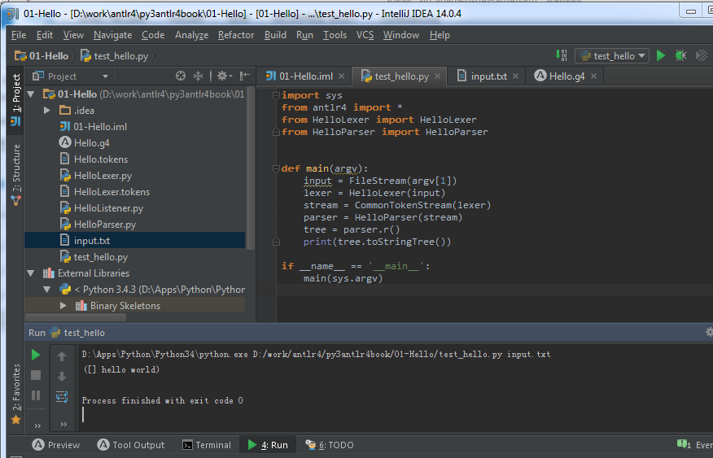

# py3antlr4book
Covert ANTLR4 book source code to Python 3 version. 

# How to use

## Windows

- Install Python
- Install antlr4 python3 runtime 

```bash
 pip install antlr4-python3-runtime
```

- open command and run bin/antlr4.bat

You may need to compile the latest ANTLR4 and put it into bin, modify the bat file

You may also need to use the latest runtime, just copy the source to [PythonDir]\Lib\site-packages\antlr4

## Ubuntu

```bash
sudo apt install environment-modules
sudo -H pip3 install antlr4-python3-runtime
git clone https://github.com/jszheng/py3antlr4book.git
cd py3antlr4book
# goto https://www.antlr.org/download.html 
# download the latest ver
wget -P bin/ https://www.antlr.org/download/antlr-4.11.1-complete.jar
ln -s bin/antlr-4.11.1-complete.jar antlr.jar
module load ./antlr4module
```


# run first example

```
% antlr4py3 Hello.g4
% pygrun Hello r --tokens input.txt
[@0,0:4='hello',<1>,1:0]
[@1,6:10='world',<2>,1:6]
[@2,11:10='<EOF>',<-1>,1:11]

% pygrun Hello r --tree input.txt
(r hello world)

% python test_hello.py input.txt
(r hello world)
```

# IDE
You can install the best python IDE in the world (no 'one of') from www.jetbrains.com. They provide two community version free of charge and just enough for the experiment here.

The only problem is the tool take a large amount of memory just like all JAVA based IDE, you may not want to open IDEA and PyCharm at the same time. I only install IDEA and install the python community plug-in and also ANTLR4 plug-in to debug the .g4 file. 



